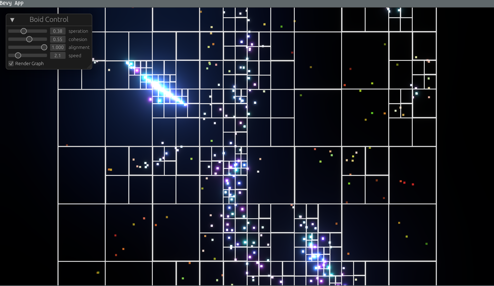

# Boids with Quadtree using Bevy and Rust



Quadtree implementation together with a simple Boid algorithm.


## Run

```
cargo run --release
```

## Export to wasm

there is simple shell script to generate and export wasm bind files. Inside the www folder ist a npm vite setup to test with.

```
cargo build --release --target wasm32-unknown-unknown
wasm-bindgen --out-dir ./www/out/ --target web ./target/wasm32-unknown-unknown/release/boids-quadtree.wasm

cd www
npm install
npm run dev
```
